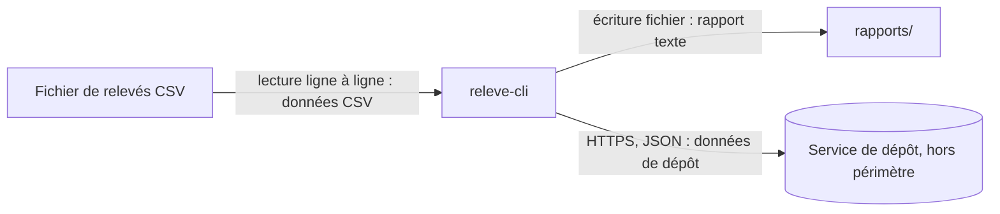

# Architecture de `releve-cli`

## Schéma

## Légende

* **Rectangle** : composant ou fichier faisant partie du système décrit.
* **Rectangle arrondi** : programme ou composant logiciel exécuté.
* **Cylindre** : service externe ou système de données.
* **Flèche** : flux entre deux blocs.
* **Étiquette de flèche** : moyen de communication, sens du flux et données transportées.

## Périmètre

Le schéma couvre la lecture des fichiers CSV par `releve-cli`, leur traitement et la production des rapports texte dans `rapports/`.

Le service de dépôt externe, son infrastructure, son stockage et son fonctionnement interne sont **hors périmètre**. Le schéma ne décrit pas non plus le déploiement de `releve-cli` ni l'environnement d'exécution de l'application.

## Date de validité

État de l'architecture constaté le **6 octobre 2026**.
